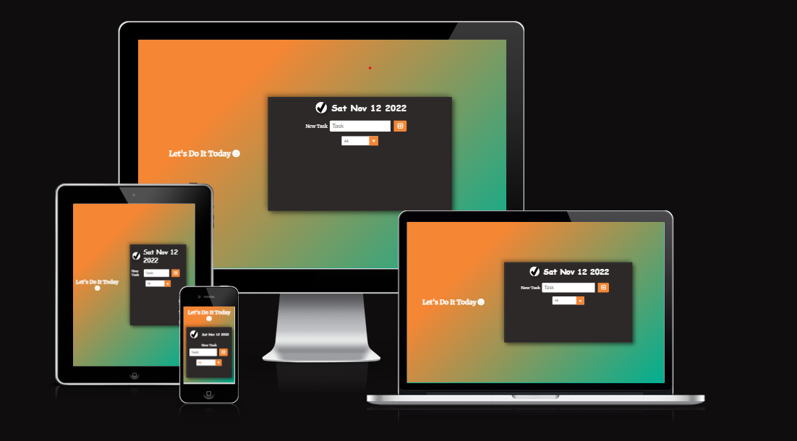
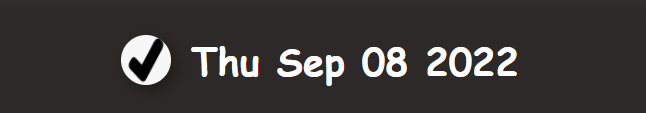
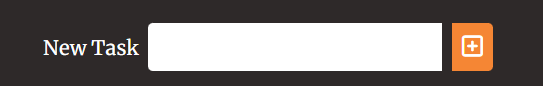
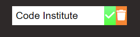
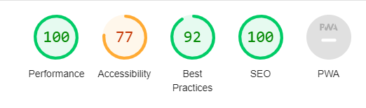

- [Contents](#contents)
- [ToDoList](#ToDoList)
  + [UX](#ux "UX")
   + [Site Purpose](#site-purpose "Site Purpose")
   + [Site Goal](#site-goal "Site Goal")
   + [Audience](#audience "Audience")
   + [Communication](#communication "Communication")
   + [Current User Goals](#current-user-goals "Current User Goals")
   + [New User Goals](#new-user-goals "New User Goals")
 + [Design](#design "Design")
   + [Colour Scheme](#color-scheme "Color Scheme")
   + [Typography](#typography "Typography")
   + [Imagery](#imagery "Imagery")
 + [Features](#features "Features")
   + [Existing Features](#existing-features "Existing Features")
   + [Future Features](#future-features "Future Features")
 + [Testing](#testing "Testing")
   + [Validator Testing](#validator-testing "Validator Testing")
 + [Technologies Used](#technologies-used "Technologies Used")
   + [Main Languages Used](#main-languages-used "Main Languages Used")
   + [Frameworks, Libraries & Programs Used](#frameworks-libraries-programs-used "Frameworks, Libraries & Programs Used")
 + [Deployment](#deployment "Deployment")
 + [Credits](#credits "Credits")
   + [Content](#content "Content")
   + [Media](#media "Media")
# ToDoList

The ToDoList site is live, the link to which can be found [HERE](https://zabeenasherzoie.github.io/ToDoList/)
## UX:
### Site Purpose:
Help you to organize your daily tasks.
### Site Goal:
The intent of the  website is to introduce our audience to an app that keeps track of their daily tasks.
### Audience:
 It is targeted at an audience of all ages.Those who want to become more disciplined.
### Communication:
With a clear & bold design, this app is easy to use and interact.
### Current User Goals:
To add track their daily tasks and manage their time and energy.
### New User Goals:
To gain a good experience of organizing their daily tasks.
# Design:
## Color Scheme:
The colour palette was created with the thought to provide as much contrast as possible.
### Typography:
Merriweather was selected as font for the main heading and body. The colors have contrast and the content are easy to see.
### Imagery:
The image which is used in header was downloaded from google.
## Features:
### Existing Features:
#### Date Bar:
Shows the date of the day you are opening it.

#### Adding Task:
Allows you to input new task.

#### Filter:
Allows you to check which tasks are completed or which ones are not completed.

#### Tasks to be done:
A list of the tasks to be done.

#### Completed Task:
Shows a task that is completed and you can either remove it or keep it.

### Future Features:
- The feature to add the exact due time for a task.
## Testing:
The media queries were very challenging. It took a lot of trial & error in the Chrome Dev tool to adjust everything accordingly so that it would not display horribly when the page was to be resized.
I faced problem figuring out the right rules for the form  responsivity issue specialy for less than 500px wide screens. And it seems to still have problem.
I got stuck on how to change the place of input element and select element when the screen gets smaller,then I figured out to use two form elements.
### Validator Testing:
- Html files pass through the [W3C validator](https://validator.w3.org/) with no issues found.

- CSS files pass through the [Jigsaw validator](https://jigsaw.w3.org/css-validator/) with no issues found.

-This is page's rating in Lighthouse

- JavaScript code passed through  Jshint with no significant issues.
- Tested the site opens in Brave, Chrome & Safari without issues.
- All links open to external pages as intended.
## Technologies Used:
### Main Languages Used:
- HTML5
- CSS3
-JavaScript

### Frameworks, Libraries & Programs Used:
- Google Fonts 
- Font Awesome - to add icons to the buttons and h1.
- GitPod - to creat my html files & styling sheet a script sheet  before pushing the project to Github.
- GitHub - to store my repository for submission.
- Am I Responsive? - to ensure the project looked good across all devices.
## Deployment:
The site was deployed to GitHub pages. The steps to deploy are as follows:
- In the GitHub repository, navigate to the Settings tab
- Go to the page section.
 From the source section drop-down menu, select the main Branch
- Once the main branch has been selected, the page will be automatically refreshed with a detailed ribbon display to indicate the successful deployment.
- The live link can be found [HERE-->ToDoList](https://zabeenasherzoie.github.io/ToDoList/)
## Credits:

### Content:
The base code of the project is taken from  [This tutorial](https://www.youtube.com/watch?v=Ttf3CEsEwMQ&t=1104s&ab_channel=developedbyed) in youtube.
### Media:
The image in the header was downloaded from google.

